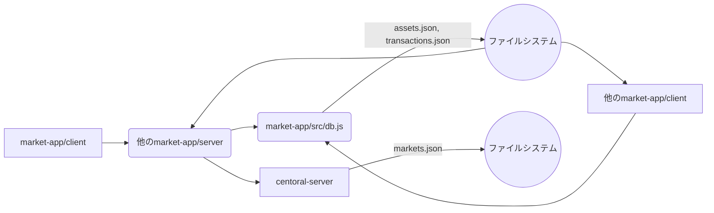

# プロジェクト構造

## ディレクトリ構成

```
http-market-app/
├── market-app/           # 学生アプリ
│   ├── client/          # クライアントサイド
│   │   ├── src/
│   │   │   ├── index.js       # メインファイル
│   │   │   ├── components/    # UIコンポーネント
│   │   │   ├── api.js         # APIクライアント
│   │   │   ├── utils.js       # ユーティリティ関数
│   │   │   └── App.js         # アプリケーションのエントリーポイント
│   │   ├── public/        # 静的ファイル
│   │   │   └── index.html     # HTMLファイル
│   │   ├── package.json
│   │   └── README.md
│   ├── server/          # サーバーサイド
│   │   ├── src/
│   │   │   ├── index.js       # メインファイル
│   │   │   ├── api.js         # APIエンドポイント定義
│   │   │   ├── models/        # データモデル
│   │   │   ├── utils.js       # ユーティリティ関数
│   │   ├── package.json
│   │   └── README.md
│   ├── src/
│   │   ├── db.js          # データベースアクセスモジュール
│   │   ├── assets.json    # 資産情報（資金、在庫）
│   │   ├── transactions.json # 取引履歴
├── centoral-server/  # マーケット情報サーバー（別アプリ）
│   ├── src/
│   │   ├── index.js       # メインファイル
│   │   ├── api.js         # APIエンドポイント定義
│   │   ├── db.js          # データベースアクセスモジュール
│   │   ├── markets.json   # マーケット情報
│   │   └── utils.js       # ユーティリティ関数
│   ├── package.json
│   └── README.md
├── docs/
│   └── spec.md        # 技術仕様書
└── README.md            # プロジェクト全体のREADME
```

## 各ファイルの役割

- **market-app/**
  - **client/**
    - `src/index.js`: クライアントサイドのエントリーポイント。React アプリケーションを初期化し、DOM にマウントします。
    - `src/components/`: UI コンポーネントを格納するディレクトリ。
    - `src/api.js`: 他の`market-app/server`の API との通信を行うためのクライアント。
    - `src/utils.js`: ユーティリティ関数を定義します。
    - `src/App.js`: アプリケーションのルートコンポーネント。
    - `public/index.html`: HTML ファイル。
    - `package.json`: 依存関係、スクリプトなどを定義します。
    - `README.md`: クライアントサイドに関する情報を提供します。
  - **server/**
    - `src/index.js`: サーバーサイドのエントリーポイント。Express サーバーを起動し、API エンドポイントを定義します。
    - `src/api.js`: API エンドポイントの定義と実装を行います。
    - `src/models/`: データモデルを定義するディレクトリ（例：Product、Order）。
    - `src/utils.js`: ユーティリティ関数を定義します。
    - `package.json`: 依存関係、スクリプトなどを定義します。
    - `README.md`: サーバーサイドに関する情報を提供します。
  - **src/**
    - `db.js`: `readFile`、`writeFile`関数を提供し、ファイル I/O を抽象化します。
    - `assets.json`: 資金、在庫などの資産情報を管理します。
    - `transactions.json`: 取引履歴を記録します。
- **centoral-server/**
  - `src/index.js`: サーバーのエントリーポイント。Express サーバーを起動し、API エンドポイントを定義します。
  - `src/api.js`: `/register`、`/markets`などの API エンドポイントの定義と実装を行います。
  - `src/db.js`: `readFile`、`writeFile`関数を提供し、ファイル I/O を抽象化します。
  - `src/markets.json`: マーケット情報を管理します。
  - `src/utils.js`: ユーティリティ関数を定義します。
  - `package.json`: 依存関係、スクリプトなどを定義します。
  - `README.md`: マーケット情報サーバーに関する情報を提供します。

## データフロー

- `market-app/client`は、他の`market-app/server`の API と通信します。
- すべての`market-app/client`と`market-app/server`は、`market-app/src`ディレクトリの`db.js`を通じてローカルファイルにアクセスし、`assets.json`と`transactions.json`を共有します。
- `market-app/client`は、UI を通じてユーザーからの入力を受け付け、他の`market-app/server`にリクエストを送信します。
- `centoral-server`は、`market-app/server`から登録されたマーケット情報を保持します。

## 状態管理

- `market-app/client`は、UI の状態を React の state で管理します。
- `market-app/server`は、`assets.json`、`transactions.json`を通じて状態を永続化します。
- `centoral-server`は、`markets.json`を通じてマーケット情報を永続化します。

## Mermaid ダイアグラム


